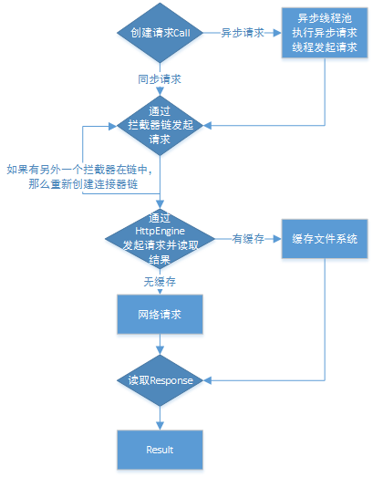

#OkHttp
OkHttp是基于责任链模式设计的，和HttpUrlConnection一样，从Android4.4开始，OkHttp就成为支持HttpUrlConnection的引擎[Jake Wharton Twitter](https://twitter.com/JakeWharton/status/482563299511250944)。
###OkHttp的使用
1. 创建OkHttpClient对象
2. 创建一个Request请求，然后得到Call对象。Call call= mOkHttpClient.newCall(request)
3. 请求加入调度。同步请求执行call.execute()返回Response对象；异步请求执行call.enqueue(new CallBack(){}）

###OkHttp源码分析
请求流程示例图



1. 责任链分析
   * 分析RealCall.execute()--getResponseWithInterceptorChain()。
   * RealInterceptorChain可以说是真正把这些拦截器串起来的一个角色。一个个拦截器就像一颗颗珠子，而RealInterceptorChain就是把这些珠子串连起来的那根绳子。
   * 明白了OkHttp中的分层思想，每一个interceptor只处理自己的事，而剩余的就交给其他的interceptor。这种思想可以简化一些繁琐复杂的流程，从而达到逻辑清晰、互不干扰的效果。
   
   ```
   Response getResponseWithInterceptorChain() throws IOException {
    // Build a full stack of interceptors.
    List<Interceptor> interceptors = new ArrayList<>();
    // 添加用户自定义的拦截器，譬如修改请求头的拦截器等
    interceptors.addAll(client.interceptors());
    // 是用来重试和重定向的拦截器
    interceptors.add(retryAndFollowUpInterceptor);
    // 是用来将用户友好的请求转化为向服务器的请求，之后又把服务器的响应转化为对用户友好的响应
    interceptors.add(new BridgeInterceptor(client.cookieJar()));
    // 缓存拦截器，若存在缓存并且可用就直接返回该缓存，否则会向服务器请求
    interceptors.add(new CacheInterceptor(client.internalCache()));
    // 用来建立连接的拦截器
    interceptors.add(new ConnectInterceptor(client));
    if (!forWebSocket) {
      // 加入用户自定义的网络拦截器
      interceptors.addAll(client.networkInterceptors());
    }
    // 真正向服务器发出请求且得到响应的拦截器
    interceptors.add(new CallServerInterceptor(forWebSocket));

    Interceptor.Chain chain = new RealInterceptorChain(interceptors, null, null, null, 0,
        originalRequest, this, eventListener, client.connectTimeoutMillis(),
        client.readTimeoutMillis(), client.writeTimeoutMillis());

    return chain.proceed(originalRequest);
  }
   ```
   
2. 缓存分析
3. 线程切换Dispatcher 
   * 从enqueue的方法分析，OkHttp在运行中的异步请求数最多为63，而同一个host的异步请求数最多为4。否则会加入到readyAsyncCalls中。

	```
	synchronized void enqueue(AsyncCall call) {
	    // 如果当前正在运行的异步 call 数 < 64 && 队列中请求同一个 host 的异步 call 数 < 5
	    // maxRequests = 64，maxRequestsPerHost = 5
	    if (runningAsyncCalls.size() < maxRequests && runningCallsForHost(call) < maxRequestsPerHost) {
	        // 加入正在运行异步队列
	        runningAsyncCalls.add(call);
	        // 加入到线程池中
	        executorService().execute(call);
	    } else {
	        // 加入预备异步队列
	        readyAsyncCalls.add(call);
	    }
	}
	```
	
	
参看文章：
[OkHttp源码分析](https://juejin.im/entry/597800116fb9a06baf2eeb63)	
