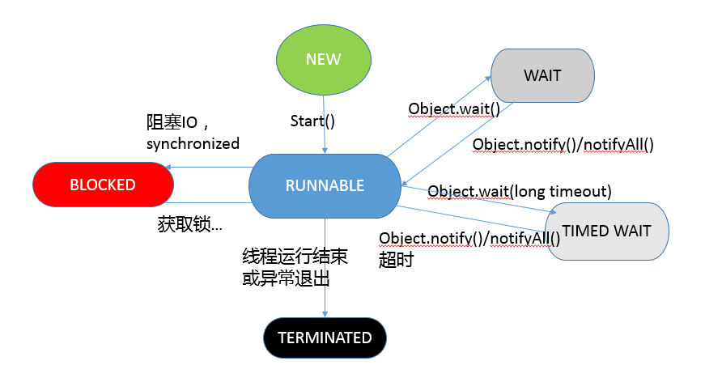

###线程细节说明
 1. 线程是系统调度的最小单元
 2. 线程不能多次调用start方法，不然会抛出异常（IllegalThreadStateException）
 3. 线程变量threadLocals设计为Map是因为线程可以存放多个ThreadLocal局部变量，Key为ThreadLocal，Value是ThreadLocal存放的数据T
 4. ThreadLocal不要和线程池配合使用，这样会导致ThreadLocal里面的值对象不能被回收。

###线程的状态
1. 新建（NEW），表示线程创建出来还没有启动。
2. 就绪（RUNNABLE），表示线程已经在JVM中执行。当然执行需要资源，也许正在运行，也许等待系统分配CPU片段。
3. 阻塞（BLOCKED），表示线程在等待锁对象
4. 等待（WAITING），表示正在等待其他线程采取某些操作，就是执行的条件不满足，让当前线程wait()，等条件满足了再调用notify
5. 计时等待（TIMED_WAITING），和等待类似，但是有超时时间
6. 终止（TERMINATED），不管是意外退出还是正常执行结束，表示线程已经完成，终止运行。

###线程状态和方法的对应图

