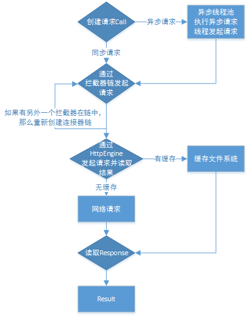

#OkHttp
OkHttp是基于责任链模式设计的，和HttpUrlConnection一样，从Android4.4开始，OkHttp就成为支持HttpUrlConnection的引擎[Jake Wharton Twitter](https://twitter.com/JakeWharton/status/482563299511250944)。
###OkHttp的使用
1. 创建OkHttpClient对象
2. 创建一个Request请求，然后得到Call对象。Call call= mOkHttpClient.newCall(request)
3. 请求加入调度。同步请求执行call.execute()返回Response对象；异步请求执行call.enqueue(new CallBack(){}）

###OkHttp源码分析
请求流程示例图



1. 责任链分析
   * 分析RealCall.execute()--getResponseWithInterceptorChain()。
   * RealInterceptorChain可以说是真正把这些拦截器串起来的一个角色。一个个拦截器就像一颗颗珠子，而RealInterceptorChain就是把这些珠子串连起来的那根绳子。
   * 明白了OkHttp中的分层思想，每一个interceptor只处理自己的事，而剩余的就交给其他的interceptor。这种思想可以简化一些繁琐复杂的流程，从而达到逻辑清晰、互不干扰的效果。
   * Interceptor的intercept()方法调用chain.proceed(request)，就会调用拦截器序列的下一个Interceptor；反之可以不用调用chain.proceed来打断这个请求链。
   * okhttp很巧妙利用index自增的方式来实现每个拦截器的传递。这就是责任链模式的高级应用。
   
   ```
   Response getResponseWithInterceptorChain() throws IOException {
        // Build a full stack of interceptors.
        List<Interceptor> interceptors = new ArrayList<>();
        // 添加用户自定义的拦截器，譬如修改请求头的拦截器等
        interceptors.addAll(client.interceptors());
        // 是用来重试和重定向的拦截器
        interceptors.add(retryAndFollowUpInterceptor);
        // 是用来将用户友好的请求转化为向服务器的请求，之后又把服务器的响应转化为对用户友好的响应
        interceptors.add(new BridgeInterceptor(client.cookieJar()));
        // 缓存拦截器，若存在缓存并且可用就直接返回该缓存，否则会向服务器请求
        interceptors.add(new CacheInterceptor(client.internalCache()));
        // 用来建立连接的拦截器
        interceptors.add(new ConnectInterceptor(client));
        if (!forWebSocket) {
            // 加入用户自定义的网络拦截器
            interceptors.addAll(client.networkInterceptors());
        }
        // 真正向服务器发出请求且得到响应的拦截器
        interceptors.add(new CallServerInterceptor(forWebSocket));

        Interceptor.Chain chain = new RealInterceptorChain(interceptors, null, null, null, 0,
                originalRequest, this, eventListener, client.connectTimeoutMillis(),
                client.readTimeoutMillis(), client.writeTimeoutMillis());

        return chain.proceed(originalRequest);
    }
   ```
   
2. 缓存分析CacheInterceptor.CacheStrategy
   * 首先尝试获取缓存。
   * 获取配置的缓存策略。
   * 有缓存则更新命中率。
   * 如果缓存不符合要求，将其close。
   * 如果不能使用网络，又没有符合条件的缓存，直接抛出504错误。
   * 如果有缓存且不使用网络，则直接返回缓存结果。
   * 获取网络返回数据，并且更新缓存。
3. 线程切换Dispatcher 
   * 从enqueue的方法分析，OkHttp在运行中的异步请求数最多为63，而同一个host的异步请求数最多为4。否则会加入到readyAsyncCalls中。

	```
	synchronized void enqueue(AsyncCall call) {
	    // 如果当前正在运行的异步 call 数 < 64 && 队列中请求同一个 host 的异步 call 数 < 5
	    // maxRequests = 64，maxRequestsPerHost = 5
	    if (runningAsyncCalls.size() < maxRequests && runningCallsForHost(call) < maxRequestsPerHost) {
	        // 加入正在运行异步队列
	        runningAsyncCalls.add(call);
	        // 加入到线程池中
	        executorService().execute(call);
	    } else {
	        // 加入预备异步队列
	        readyAsyncCalls.add(call);
	    }
	}
	```
	* 同步请求或者异步请求执行完成都会调用Dispatcher.finished()方法。异步请求会执行promoteCalls()方法。分析其方法，首先检测正在运行的异步任务是否超过最大请求数，其次检测是否有已经加入预备异步队列的请求，最后满足条件就移出预备队列，加入正在运行的异步队列并且执行。
	
	```
	private void promoteCalls() {
        if (runningAsyncCalls.size() >= maxRequests) return; // Already running max capacity.
        if (readyAsyncCalls.isEmpty()) return; // No ready calls to promote.

        for (Iterator<AsyncCall> i = readyAsyncCalls.iterator(); i.hasNext(); ) {
            AsyncCall call = i.next();

            if (runningCallsForHost(call) < maxRequestsPerHost) {
                i.remove();
                runningAsyncCalls.add(call);
                executorService().execute(call);
            }

            if (runningAsyncCalls.size() >= maxRequests) return; // Reached max capacity.
        }
    }
	```
	
	
参看文章：
[OkHttp源码分析](https://juejin.im/entry/597800116fb9a06baf2eeb63)	
