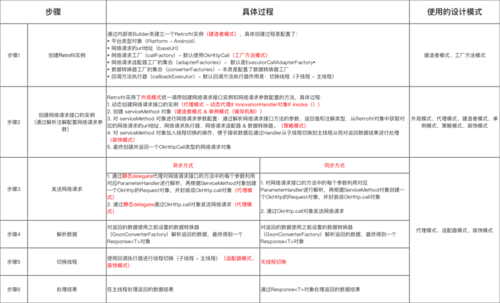

#Retrofit
Retrofit是基于OkHttp之上，一个Restful设计风格的Http网络请求框架（网络请求的工作本质上是OkHttp完成，而Retrofit仅负责 网络请求接口的封装），类似于Volley基于HttpURLConnection之上的封装。通过注解配置网络请求参数，支持同步或异步网络请求，支持多种数据解析和序列化格式(Gson、Json、XML、Protobuf、Moshi)，特别提供对RxJava的支持。

###Retrofit的使用
1. 编写一个接口类譬如ApiService，里面编写请求方法。关于返回值，可以返回一个Call对象或者返回一个Observable对象配合RxJava使用。
2. 使用建造者模式创建Retrofit对象，譬如配置baseUrl、client、addConverterFactory等。
3. 调用retrofit.create(Apiservice.class)返回接口对象，然后调用里面的方法执行相应的请求。
4. 调用apiService.en

###Retrofit源码分析
1. Retrofit.create()，首先检测传入的ServiceInterface是否合法。然后使用动态代理返回对象。
  
  ```
  public <T> T create(final Class<T> service) {
        Utils.validateServiceInterface(service);
        if (validateEagerly) {
            eagerlyValidateMethods(service);
        }
        return (T) Proxy.newProxyInstance(service.getClassLoader(), new Class<?>[]{service},
                new InvocationHandler() {
                    private final Platform platform = Platform.get();

                    @Override
                    public Object invoke(Object proxy, Method method, @Nullable Object[] args)
                            throws Throwable {
                        // If the method is a method from Object then defer to normal invocation.
                        if (method.getDeclaringClass() == Object.class) {
                            return method.invoke(this, args);
                        }
                        if (platform.isDefaultMethod(method)) {
                            return platform.invokeDefaultMethod(method, service, proxy, args);
                        }
                        return loadServiceMethod(method).invoke(args);
                    }
                });
    }
  ```
2. 分析Retrofit.loadServiceMethod()方法。首先在缓存方法Map里查找，没有就新建一个ServiceMethod对象，然后放入缓存方法的Map里。
3. 通过相关注解配置好ServiceMethod对象，例如RequestFactory（网络请求工厂）、CallAdapter（适配器）、Converter<ResponseBody, ResponseT>（负责将服务器返回的数据转化为ResponseT对象）等等。
4. HttpServiceMethod.invoke()方法创建OkHttpCall对象。
5. 调用同步(execute)或者异步(enqueue)方法返回网络对象。
6. 分析一下execute()方法
   
   * 创建一个OkHttp的Request对象请求
   * 调用OkHttp的execute()发送同步请求
   * 解析网络请求返回的数据parseResponse()

###总结
Retrofit本质上是一个Restful的Http网络请求框架的封装，即通过大量的设计模式封装了OkHttp，使得简洁易用。

1. Retrofit将Http请求抽象成Java接口。
2. 在接口里注解描述和配置网络请求参数。
3. 使用动态代理的方式，动态将网络请求接口的注解解析成Http请求
4. 最后执行Http请求

分析源码图


参考链接[](https://www.jianshu.com/p/0c055ad46b6c)